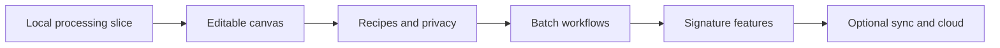

# Hexlode — Implementation Plan

> Status: Working execution plan
> Updated: 2026-08-05
> Product direction: [idea.md](./idea.md)

## 1. Objective

Build one dependable browser-local image pipeline, connect it to the visual canvas, and expand only
after the real processing path works.

The implementation rule is:

> Ship vertical slices inside one application. Extract infrastructure only when actual use requires
> it.

## 2. Decisions Already Made

- Keep a single repository and a single TanStack Start application.
- Organize domain code with Bulletproof React-style feature modules under `src/features`.
- Keep processing logic outside React components, but inside this application.
- Use React Flow for graph editing and Astryx for the product interface.
- Use proven image codecs and platform libraries rather than writing format implementations.
- Keep anonymous local processing as the default.
- Defer SDK, CLI, plugin, desktop, and cloud-platform architecture.
- Add tests and infrastructure when a real feature creates something meaningful to verify.

## 3. Current Foundation

The repository already has:

- TanStack Start, React 19, TypeScript, Vite, and TanStack Router.
- React Flow, Astryx with the neutral theme, and Tailwind.
- PostgreSQL, Drizzle ORM, and a local `hexlode` database.
- Better Auth installed, but not yet connected to a database adapter.
- PostHog and Sentry integrations.
- Biome formatting and linting.
- Husky, lint-staged, Commitlint, and Conventional Commits.
- Node and pnpm version constraints.
- A production build and local development server that pass validation.

Do not rebuild or reorganize this foundation without a concrete problem.

## 4. Application Structure

Add feature folders only as implementation reaches them:

```text
src/
  routes/
  features/
    processing/
      codecs/             Format adapters added one at a time
      worker/             Worker entry and message handling
      schemas/            Operation and message validation
      services/           Planning, execution, cache, and cancellation
      types/              Feature-owned contracts
    image-input/
    canvas/
    comparison/
    recipes/
    privacy/
    cloud-processing/     Create only if remote processing is approved
  components/             Shared across multiple features
  integrations/           Existing providers and framework adapters
  lib/                    Small application-wide utilities
  db/
```

Rules:

- A feature owns its UI, hooks, state, schemas, services, and types.
- Routes compose features; they do not contain processing logic.
- Shared code moves to `components` or `lib` only after at least two features use it.
- Do not create barrel files, generic repositories, factories, or interfaces without a real need.
- Do not create workspace packages while the web application is the only consumer.

## 5. Dependency Policy

Write Hexlode-specific behavior ourselves:

- Typed graph validation.
- Recipe parsing and migration.
- Execution planning and downstream invalidation.
- Memory-aware batch policy.
- Progress, cancellation, and error semantics.
- Codec comparison and bounded constraint search.
- Privacy modes and remote-boundary consent.

Use established dependencies for:

- JPEG, PNG, WebP, AVIF, HEIC, and other codec implementations.
- ZIP and archive standards.
- Cryptography and hashing primitives.
- Authentication, database access, graph interaction, UI primitives, and schemas.

A new dependency needs an active maintenance record, compatible licence, acceptable bundle cost,
and a clear advantage over the platform or an installed dependency.

## 6. Implementation Sequence



Milestones 1 and 2 establish the working local canvas. Milestone 3 is the next implementation target.

## 7. Milestone 1 — Local Processing Vertical Slice

### Outcome

Process one real image without blocking the interface:

```text
JPEG or PNG input -> inspect -> resize -> WebP encode -> compare -> download
```

### Work

1. Create the `processing`, `image-input`, and `comparison` features as needed.
2. Define the smallest operation and worker-message schemas.
3. Accept a JPEG or PNG through file selection and drag-and-drop.
4. Validate MIME signature, dimensions, and an initial allocation estimate.
5. Decode, resize, and encode WebP inside a dedicated Web Worker.
6. Use an established browser or WebAssembly implementation behind a small local adapter.
7. Transfer buffers where supported instead of cloning large pixel data.
8. Report progress, cancellation, warnings, and structured errors.
9. Show before-and-after previews, dimensions, file sizes, and percentage saved.
10. Download the result.
11. Add the smallest tests for validation, worker messages, and cancellation behavior.
12. Record baseline processing time and peak-risk memory assumptions for representative images.

### Not included

- A worker pool.
- Multiple output codecs.
- Graph branching.
- Accounts or database writes.
- Offline installation.
- SDK, CLI, or package extraction.
- WebGPU, custom native codecs, or cloud processing.

### Exit gate

- A valid JPEG and PNG complete the pipeline.
- The interface remains responsive during processing.
- Cancellation stops work and releases retained references.
- Malformed and oversized input returns a controlled error.
- The output downloads and opens correctly.
- `pnpm validate` passes.

### Initial baseline

Measured in headless Chromium on 2026-08-04:

- PNG: 1597 × 1198, 1.8 MB -> 284.9 KB WebP in 334 ms.
- JPEG: 400 × 400, 12.5 KB -> 5.2 KB WebP in 17 ms.
- Safety limits: 30 MB input, 16,384 px per edge, 256 MiB decoded pixels, and a 320 MiB
  estimated peak allocation.

These smoke-test measurements establish the first regression baseline; they are not performance
guarantees across devices.

## 8. Milestone 2 — Editable Canvas

### Outcome

Run the proven processing slice from the real starter graph:

```text
Files -> Inspect -> Resize -> WebP -> Compare -> Download
```

### Work

1. Create the `canvas` feature and render React Flow inside an Astryx application shell.
2. Define only the ports and node types used by the starter graph.
3. Build reusable node chrome for label, state, handles, and concise settings.
4. Keep detailed settings in an inspector panel.
5. Reject incompatible connections with a useful message.
6. Compile the visible graph into the Milestone 1 operation sequence.
7. Stream worker progress and errors into node and edge state.
8. Add run, cancel, retry, add, delete, connect, and reconnect behavior.
9. Add undo and redo after graph editing is stable.
10. Add keyboard access for the essential starter workflow.
11. Store result references outside React component state.

### Exit gate

- A first-time user can drop an image and run the starter graph unchanged.
- Editing a supported node changes the real execution.
- Invalid connections cannot enter a saved graph.
- Canvas state and worker execution state remain separate.
- Progress and errors shown by the UI come from the worker.

### Implemented slice

- The starter graph compiles into the proven local worker pipeline.
- Node settings, graph edits, connection validation, runtime state, retry, cancellation, undo, and
  redo are connected to real behavior.
- The canvas has a full inspector on desktop and a compact stacked layout on narrow screens.

## 9. Milestone 3 — Recipes, Local Persistence, and Privacy

### Outcome

Make the application useful across sessions without requiring an account.

### Work

1. Create a compact versioned recipe schema.
2. Keep visual layout separate from execution settings.
3. Add local save, rename, duplicate, import, and export.
4. Use IndexedDB for recipes, preferences, and lightweight run metadata.
5. Do not retain source bytes by default.
6. Add simple migrations when the first schema change occurs.
7. Add Private Session and Local Workspace.
8. Add Airgap Mode that disables analytics and remote-capable behavior.
9. Make current privacy and execution location visible.
10. Add offline caching only after the required application and codec assets are known.

### Exit gate

- Recipes survive restart and round-trip through exported JSON.
- Private Session leaves no intentional recipe or run-history record.
- Local Workspace works without authentication.
- Airgap Mode prevents application-controlled remote operations and analytics.
- A recipe migration has a focused test when the first migration exists.

### Implemented slice

- Versioned recipe and macro-preset JSON round-trips through strict validation.
- IndexedDB stores recipes, preferences, and file-free run summaries; Private Session skips those
  writes.
- Local Workspace and Airgap Mode are visible in the workspace dialog, and Airgap disables PostHog.
- Offline asset caching remains deferred until the required asset set is stable.

## 10. Milestone 4 — Batch and Production Workflows

### Outcome

Process useful folders without uncontrolled memory growth.

### Work

1. Add `ImageBatch` only after single-image execution is stable.
2. Implement a bounded queue before adding parallel workers.
3. Choose concurrency using estimated memory and device capability.
4. Report per-file progress and collect failures without losing successful results.
5. Add folder input with browser capability fallbacks.
6. Add deterministic rename templates and collision handling.
7. Preserve relative hierarchy where supported.
8. Add ZIP output and selected-folder output where the browser permits it.
9. Add JPEG and PNG output; add AVIF after adapter and fixture validation.
10. Add orientation correction, transparency policy, and selective metadata removal.
11. Add retry-failed, continue-on-error, and cancel-queued behavior.

### Exit gate

- A representative large batch completes within a bounded memory policy.
- A corrupt file does not discard successful items.
- Cancellation stops queued work and cleans temporary references.
- Naming collisions are deterministic and recoverable.
- Metadata and transparency changes cannot occur silently.

### Implemented slice

- One serial worker queue bounds memory, continues after per-file failures, keeps successful outputs,
  and supports retry and queued cancellation.
- Multi-file and native folder input, deterministic relative output paths, ZIP delivery, and selected
  folder delivery are connected to the real worker path.
- WebP, JPEG, and PNG output are supported; JPEG transparency flattening and metadata removal are
  explicitly disclosed.
- AVIF, selective metadata preservation, and the full orientation/format fixture matrix remain gated
  on adapter validation.

## 11. Milestone 5 — Signature Features

Implement these one at a time after the underlying measurements and adapters are reliable.

### Codec Tournament

- Compare supported encoders and selected settings against the same input.
- Show size, time, quality, transparency, and compatibility.
- Reuse the existing adapters rather than adding a second execution path.

### Constraint Solver

- Start with a bounded quality search for one codec.
- Add hard work, time, and memory limits.
- Make it cancellable and deterministic for the same engine version.
- Explain when no valid result exists.

### Visual Difference Lab

- Begin with side-by-side and slider comparison.
- Add synchronized zoom, heatmap, and perceptual metrics only when correctness is verified.

### Macros and debugger

- Support a local reusable subgraph before nested or shared macro versions.
- Show runtime data emitted by the engine rather than UI-derived guesses.

### Implemented slice

- Codec Tournament measures WebP, JPEG, and PNG through the existing worker adapter.
- Constraint Solver applies memory preflight, cancellation, seven search attempts, and a 30-second
  deadline.
- Visual Difference Lab starts with the approved comparison slider.
- Local workflow macro presets and the debugger reuse the recipe schema and real worker events;
  nested/shared macros, heatmaps, and perceptual metrics remain deferred.

## 12. Milestone 6 — Optional Accounts and Cloud Processing

This milestone begins after the local product is dependable. It adds the optional server execution
intended for the full product without making an account necessary for local use.

### Recipe synchronization

1. Connect Better Auth to PostgreSQL only when account-backed sync is being implemented.
2. Synchronize recipes, macros, preferences, and versions—not images or metadata.
3. Require explicit opt-in before migrating local recipes to an account.
4. Keep sign-out and offline behavior usable.
5. Provide export and deletion for synchronized data.

### Cloud batches

1. Identify a measured workload that local execution cannot serve well.
2. Define the job boundary, quota, retention, deletion, and failure policy first.
3. Show exactly what leaves the device before each remote job.
4. Require explicit consent and make local versus remote execution visible.
5. Add idempotency, cancellation, timeouts, and cleanup before charging or broad access.
6. Keep jobs running after the browser closes and make their durable status recoverable on return.
7. Offer a generous free allowance and keep any usage-based charges inexpensive and tied to real
   processing cost.

Do not build billing, queues, object storage, or worker infrastructure before this milestone needs
them.

## 13. Experimental Backlog

Possible later experiments:

- Background removal and upscaling.
- OCR and sensitive-information redaction.
- Smart crop and local ML inference.
- GPU-accelerated transforms with CPU fallback.
- Duplicate and similarity detection.
- Dithering, palette, and unusual-codec labs.
- Public recipe sharing.

Each experiment needs a clear local or remote label, bounded resource use, and measurable value.

## 14. Testing Strategy

Keep tests proportional to current risk.

### Add with Milestone 1

- Focused unit tests for graph-independent validation and planning logic.
- Worker-protocol and cancellation tests.
- Small licensed or generated JPEG and PNG fixtures.
- Manual development and production-build smoke checks.

### Add when formats and batches expand

- Fixture-based regression tests for orientation, transparency, metadata, and malformed input.
- Deterministic output assertions where the adapter guarantees determinism.
- Perceptual thresholds where binary equality is not meaningful.
- Memory, queue, cancellation, and cache-policy tests.

### Deferred

- Playwright or another browser automation suite.
- Large cross-browser matrices.
- Property testing and benchmark infrastructure.
- Visual-regression platforms.

Revisit browser automation when a critical file API, offline path, or browser-specific regression
cannot be covered reliably by unit tests and manual release checks.

## 15. CI for the Public Repository

Start with one GitHub Actions workflow:

1. Use the Node version from `.nvmrc`.
2. Install pnpm and run `pnpm install --frozen-lockfile`.
3. Run `pnpm check`, `pnpm typecheck`, and `pnpm build` through `pnpm validate`.

Add dependency review, CodeQL, release automation, fixture matrices, or scheduled security checks when
the repository is public and those workflows have a concrete input to inspect. Free CI capacity is
welcome, but each workflow should still have a useful signal and a clear owner.

## 16. Security and Privacy Guardrails

- Treat every image as untrusted input.
- Check signatures, dimensions, and predicted allocations before decode.
- Bound worker count, search attempts, and batch memory.
- Never place file bytes, names, metadata, thumbnails, or linked hashes in analytics.
- Keep cloud processing disabled unless the user explicitly selects it.
- Do not retain source bytes or intermediates without an intentional local setting.
- Track security and licensing status for every codec dependency.
- Fail safely when a browser lacks a required capability.

These guardrails are part of the feature definition, not optional hardening work.

## 17. Decision Triggers

### Create a package or monorepo only when

- A second independently shipped application, CLI, or service must consume the same code.
- Sharing source inside this repository is no longer practical.
- The boundary has a stable API and an owner.

### Build a custom processing implementation only when

- Existing libraries cannot meet a documented requirement.
- A benchmark or correctness test demonstrates the benefit.
- Security, licensing, fixtures, and long-term maintenance are understood.

### Build cloud processing only when

- Real jobs exceed reasonable local time or memory.
- Users explicitly request the capability.
- Cost, abuse, retention, deletion, and incident policies are decided.

### Add browser automation only when

- A critical browser behavior has regressed or cannot be verified cheaply another way.

## 18. Immediate Next Target

Stabilize and measure the integrated Milestones 3–5 local release. Do not begin account, billing,
queue, storage, or cloud-worker infrastructure until Milestone 6 is explicitly approved.

## 19. Definition of Success

Implementation is on track when:

- The local product is useful without an account or backend.
- The canvas represents real execution rather than simulated progress.
- Feature modules keep the single application understandable.
- Large work is bounded, cancellable, and recoverable.
- Privacy boundaries match what the interface promises.
- New infrastructure is added in response to measured need rather than imagined reuse.

Preserve the product loop:

> Drop -> experiment visually -> compare -> save -> reuse.
